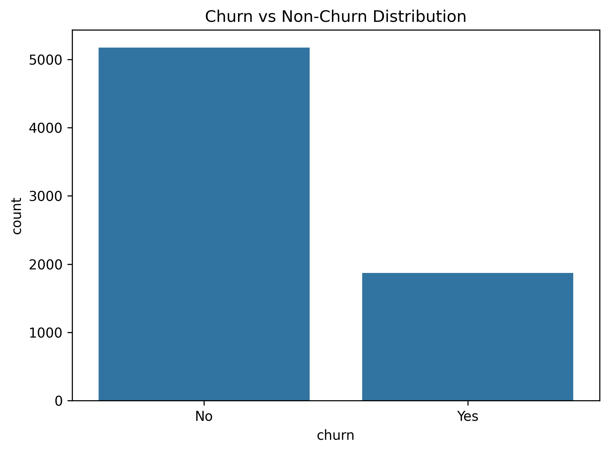
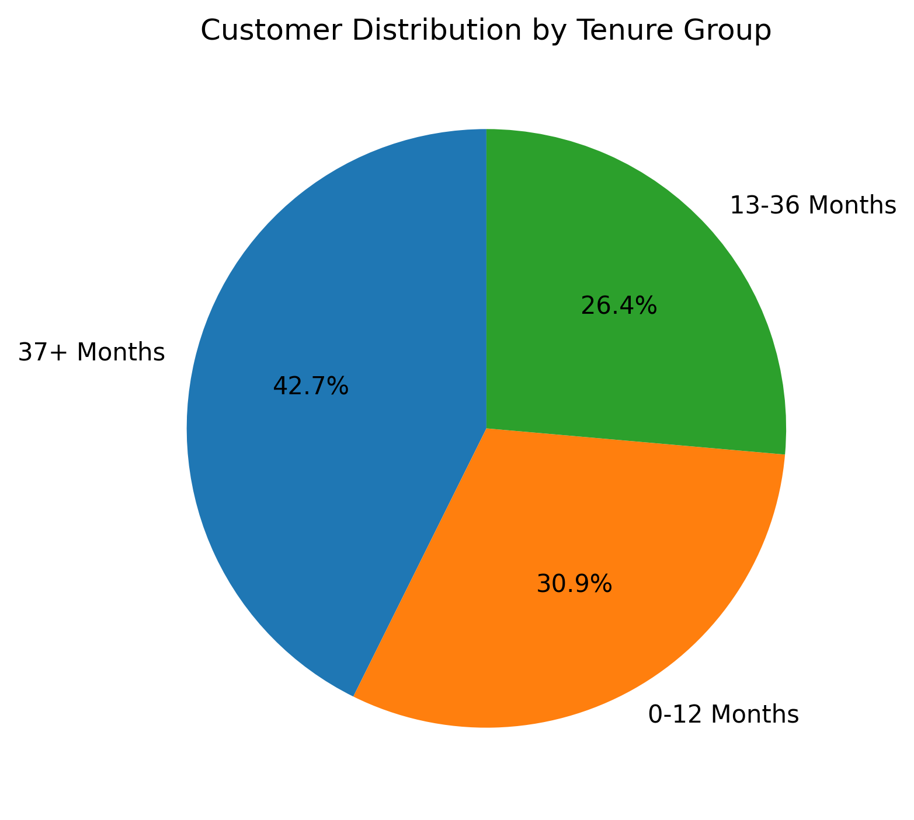
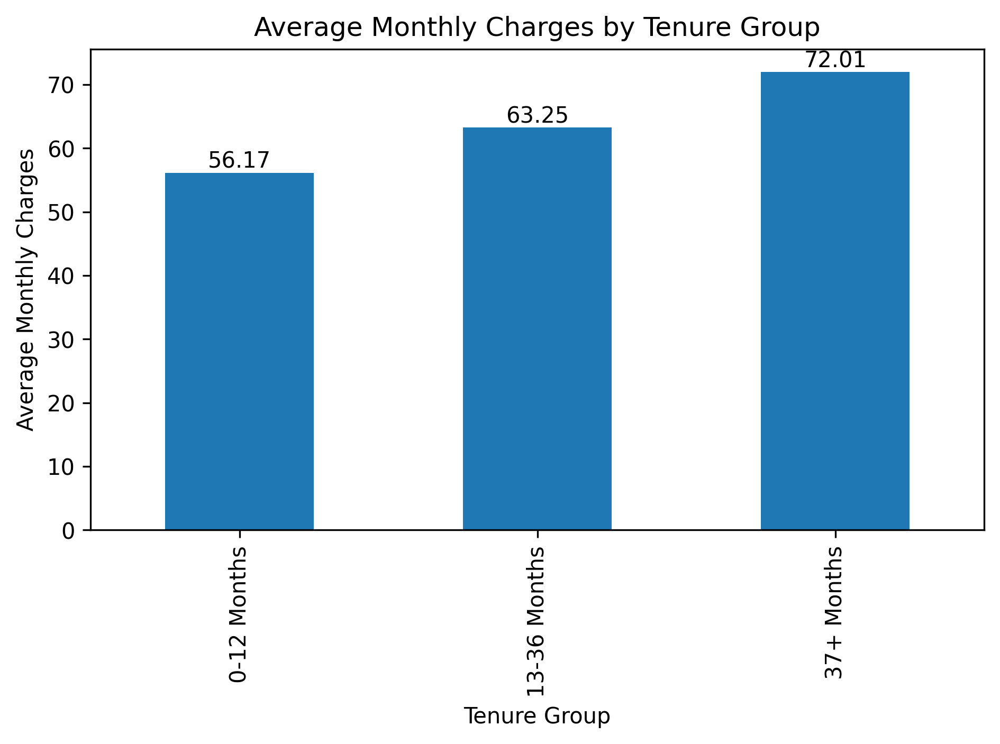
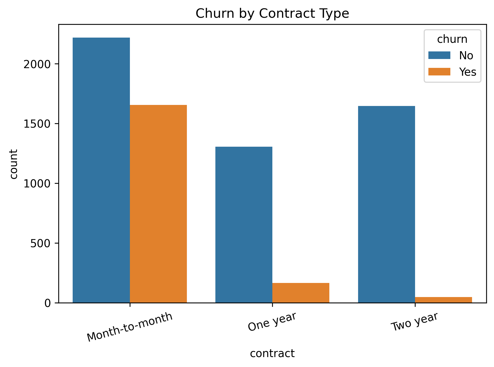
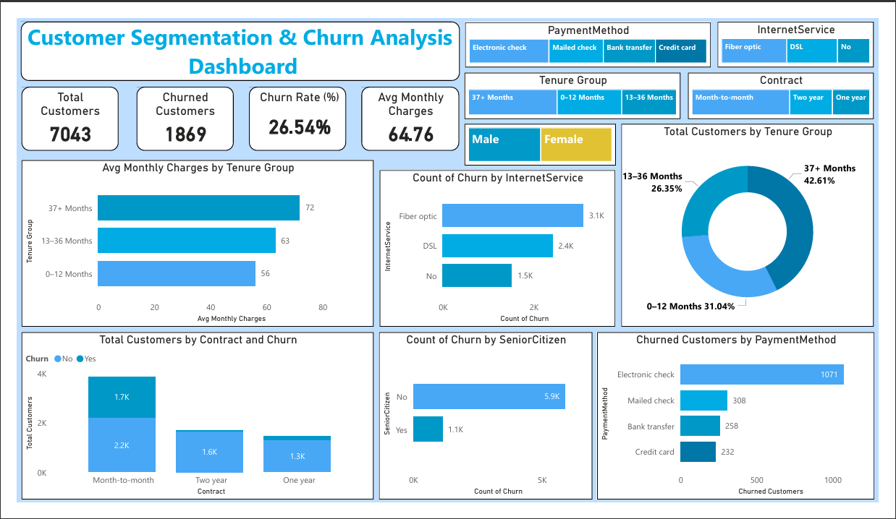

# 📊 Customer Segmentation Visualization & Advanced Analysis

This project was completed as part of a **Business Analyst Internship**.  
It focuses on analyzing **customer churn behavior** in a telecommunications company using **data analysis, visualization, and business insights** to identify at-risk customers and recommend retention strategies.

         

---

## 🏢 Internship Details
- **Role:** Business Analyst Intern  
- **Project Type:** Customer Churn Analysis & Segmentation  
- **Tools Used:** Python, Pandas, Matplotlib, Seaborn, Power BI  

---

## 🎯 Project Objective
The primary objective of this project is to:
- Analyze customer churn patterns
- Segment customers based on tenure and behavior
- Identify key churn drivers (contracts, payments, services, demographics)
- Provide **actionable business recommendations** to reduce churn and improve customer retention

---

## 📁 Project Folder Structure

```
├── Customer Segmentation Analysis.ipynb
├── Customer_Segmentation_Churn_Dashboard.pbix
├── Customer_Segmentation_Churn_Dashboard.pdf
├── README.md
├── requirements.txt
├── Telco_Customer_Churn_Dataset.csv
└── images/
    ├── 01_Churn_vs_Non-Churn_Distribution.png
    ├── 02_Tenure_Distribution.png
    ├── 03_Monthly_Charges_vs_Churn.png
    ├── 04_Customer_Distribution_by_Tenure_Group.png
    ├── 05_Average_Monthly_Charges_by_Tenure_Group.png
    ├── 06_Churn_Rate_by_Tenure_Group.png
    ├── 07_Churn_by_Gender.png
    ├── 08_Churn_by_Senior_Citizen.png
    ├── 09_Churn_by_Contract_Type.png
    ├── 10_Churn_by_Payment_Method.png
    └── Customer_Segmentation_Churn_Dashboard.png
```


---

## 📊 Dataset Overview
- **Dataset:** Telco Customer Churn Dataset
- **Target Variable:** `Churn` (Yes / No)
- **Key Features:**
  - Customer demographics (gender, senior citizen, dependents)
  - Account details (tenure, contract type, payment method)
  - Service usage (internet, phone, streaming, security)
  - Financial metrics (monthly charges, total charges)

---

## 🧩 Project Tasks & Methodology

### ✅ Task 1: Dataset Understanding
- Loaded and explored the dataset using Pandas
- Identified data types and missing values
- Understood business context of each feature

### ✅ Task 2: Data Cleaning
- Standardized column names
- Handled missing values in `TotalCharges`
- Removed duplicate records
- Ensured data consistency for analysis

### ✅ Task 3: Exploratory Data Analysis (EDA)
- Analyzed churn vs non-churn distribution
- Studied tenure, monthly charges, and churn relationships
- Used histograms, box plots, and count plots

### ✅ Task 4: Customer Segmentation Visualization
- Segmented customers into tenure groups:
  - 0–12 Months
  - 13–36 Months
  - 37+ Months
- Visualized customer distribution and average charges
- Highlighted lifecycle-based revenue patterns

### ✅ Task 5: Advanced Analysis
- Analyzed churn by:
  - Contract type
  - Payment method
  - Gender
  - Senior citizen status
- Identified high-risk customer segments
- Connected insights to business actions

---

## 📈 Sample Visualizations

### Churn Distribution


### Customer Distribution by Tenure Group


### Average Monthly Charges by Tenure


### Churn by Contract Type


---

## 📊 Power BI Dashboard
An **interactive Power BI dashboard** was created to visualize churn trends and customer segmentation.

**Dashboard Highlights:**
- KPI cards for total customers, churn rate, and average monthly charges
- Tenure-based customer segmentation
- Churn analysis by contract, payment method, and services
- Interactive slicers for dynamic exploration

📁 Files:
- `Customer_Segmentation_Churn_Dashboard.pbix`
- `Customer_Segmentation_Churn_Dashboard.pdf`



---

## 🧠 Key Business Insights
- Customers on **month-to-month contracts** have the highest churn
- **New customers (0–12 months)** are at greater churn risk
- **Electronic check payment method** shows higher churn
- Long-term contracts significantly improve customer retention
- High monthly charges correlate with churn if value perception is low

---

## 💡 Business Recommendations
- Encourage customers to switch to long-term contracts using incentives
- Improve onboarding experience for new customers
- Promote automatic payment methods
- Offer loyalty benefits to high-value customers

---

## 🚀 Skills Demonstrated
- Business Analysis & Data Interpretation
- Customer Segmentation
- Exploratory Data Analysis (EDA)
- Data Visualization (Python & Power BI)
- Insight-driven decision making
- Dashboard design & storytelling

---
